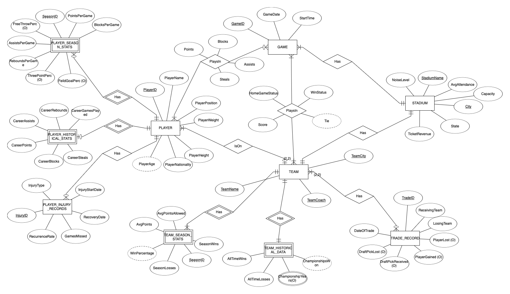
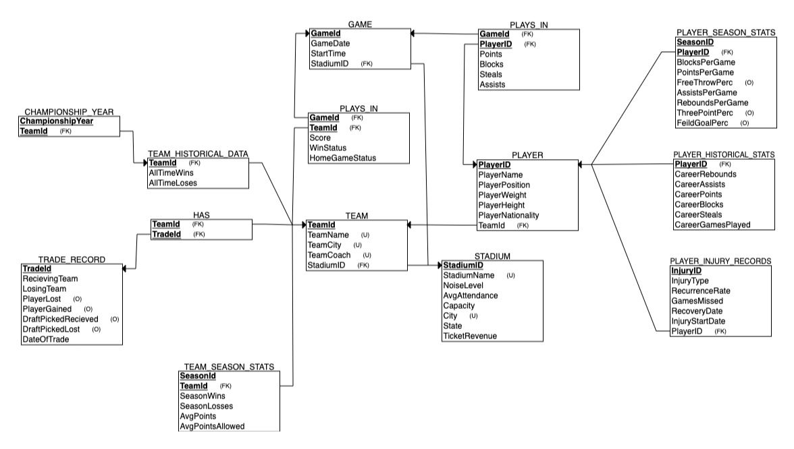

# Basketball-Database-Design
Designed and implemented a basketball database system to track players, teams, games, and historical statistics. Includes ER diagrams, relational schema, and SQL code to create the database.

## Features
- **ER Diagram**
- **Relational Schema**
- **SQL Scripts**


## ER Diagram




## Relational Schema




## SQL Scripts
The project includes the following SQL files:
- **TableCreation.sql**: Script to create all tables, sequences, indexes, and relationships.
- **DataInsertion.sql**: Script to insert sample data.
- **ExampleQueries.sql**: Example queries to extract useful insights.


## Example Queries
Here are some example SQL queries to demonstrate database functionality:

1. **Retrieve Player Game Stats**:
   ```sql
   SELECT 
      P.PlayerName,
      G.GameDate,
      G.StartTime,
      S.StadiumName,
      PP.Points,
      PP.Blocks,
      PP.Steals,
      PP.Assists
   FROM 
      Player P
   JOIN 
      Player_plays_in PP ON P.PlayerID = PP.PlayerID
   JOIN 
      Game G ON PP.GameID = G.GameID
   JOIN 
      Stadium S ON G.StadiumID = S.StadiumID
   WHERE 
      P.PlayerName = 'Alex Johnson';

**Output**:

